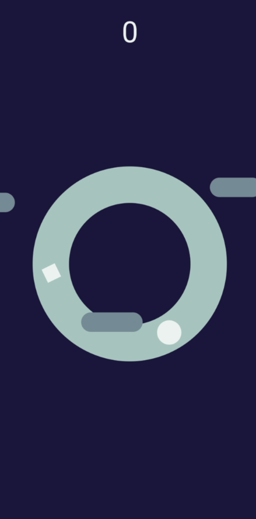
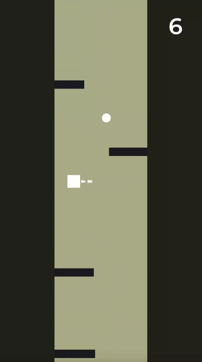
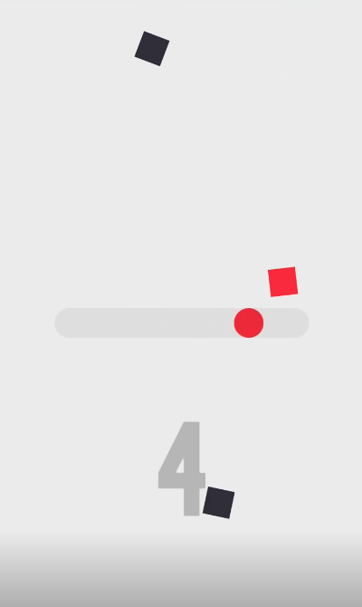
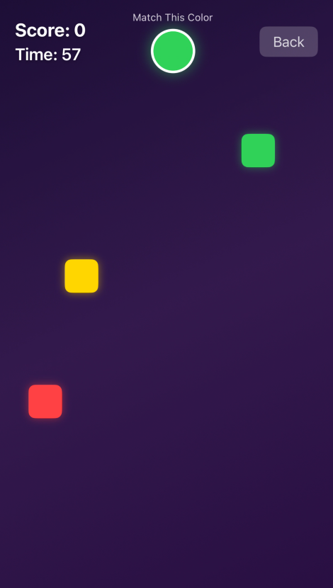

# 🎮 Shape Casuals - Android

**Shape Casuals** — це мобільний застосунок з набором простих, але захоплюючих гіперказуальних ігор, реалізованих повністю на **SDK відповідних платформ** без сторонніх ігрових рушіїв. Ігри створені в мінімалістичному стилі, з керуванням «в один клік».

---

## 🕹 Ігри в колекції

### ⭕️ Donut Spin **[в розробці]**

Круг рухається по колу, а перешкоди-прямокутники рухаються йому назустріч. Гравець, натискаючи на екран, змінює напрям руху круга.

*Приблизний вигляд гри:*

### 🧗‍♂️ Vertical Run **[в розробці]**

Квадратик летить вгору, оминаючи прямокутні перешкоди та збираючи круглі поінти. Гравець, натискаючи на екран, змушує квадратик переміститися до протилежного краю ігрового поля.

*Приблизний вигляд гри:*

### 🟦 Square Fall **[в розробці]**

Круг рухається по горизонталі та збирає квадратики, що мають з ним однаковий колір, а інших уникає. Гравець, натискаючи на екран, змінює напрям руху круга.

*Приблизний вигляд гри:*

### 🎨 Color Rush **[в розробці]**

Зверху падають квадратики різних кольорів, в той час, як гравець має за відведений час спіймати якомога більше квадратиків заданого кольору.

*Приблизний вигляд гри:*

---

## 👥 Автори

Над проектом працюють студенти групи **ІМ-21**:

- Маланін Данило (Android частина)
- Ковальов Володимир (iOS частина)

iOS частину проекту можна переглянути [тут]()
